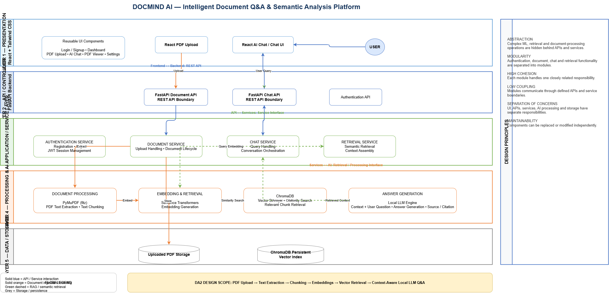

# 🧠 DocMind AI — Software Design

> An AI-powered document intelligence platform for interacting with PDF documents using Retrieval-Augmented Generation (RAG).

---

## 📌 Overview

DocMind AI follows a **layered and modular software design** that separates the frontend, API layer, backend modules, AI processing, database, and storage responsibilities.

The design emphasizes:

- **Abstraction**
- **Modularity**
- **High Cohesion**
- **Low Coupling**
- **Maintainability**
- **Future Extensibility**

---

# 🏗️ Architecture

## Architecture Style

DocMind AI uses a **layered architecture with modular backend services**.

The architecture separates presentation, API handling, application services, AI processing, database access, and file storage.

This separation makes the system easier to understand, test, maintain, debug, and extend.

## Architecture Diagram

### Editable Draw.io Source

[Open Editable Architecture Diagram](./architecture/docmind_architecture.drawio)

### Architecture Preview



---

# 🔄 System Layers

## 1. Presentation Layer

The frontend is developed using:

- React
- Tailwind CSS
- Responsive UI components

Main screens include:

- Login / Signup
- Dashboard
- Documents
- AI Chat
- Smart Learning
- Settings

---

## 2. API / Controller Layer

The backend uses **FastAPI** to expose application endpoints.

Responsibilities include:

- Authentication
- Document upload
- Chat requests
- Assessment generation
- Request validation
- API response handling

---

## 3. Application / Service Layer

The service layer separates major application responsibilities:

- Authentication service
- Document processing service
- Chat service
- Retrieval service
- AI generation service

This improves modularity and reduces coupling between components.

---

## 4. Processing & AI Layer

The document intelligence pipeline uses:

- **PyMuPDF** for PDF text extraction
- **Text chunking** for document segmentation
- **Sentence Transformers** for embeddings
- **ChromaDB** for vector similarity search
- **Gemini** for grounded response generation

---

## 5. Data & Storage Layer

The system stores:

- User and application data
- Chat history
- Uploaded PDF documents
- Vector embeddings

ChromaDB provides persistent vector storage for document retrieval.

---

# 🔍 RAG Workflow

The core document question-answering workflow follows this process:

```text
User
  ↓
React Frontend
  ↓
FastAPI
  ↓
Chat Service
  ↓
Embedding Generation
  ↓
ChromaDB Similarity Search
  ↓
Relevant PDF Chunks
  ↓
Gemini
  ↓
Grounded Answer + Citation
  ↓
React Chat Interface